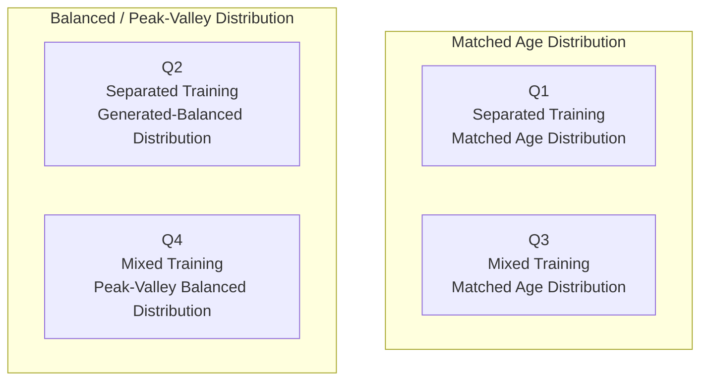

# SFCN Four-Quadrant Real/Generated Age-Bin Classification Experiments

This repository trains a `PyTorch` implementation of an `SFCN` age-bin classifier and compares real MRI with generated MRI under different training and augmentation strategies.

The current design is a four-quadrant experiment:

- Q1: `Separated Training + Matched Age Distribution`
- Q2: `Separated Training + Generated-Balanced Distribution`
- Q3: `Mixed Training + Matched Age Distribution`
- Q4: `Mixed Training + Peak-Valley Balanced Distribution`



Chinese documentation is available in:

- `README.zh.md`
- `data.zh.md`
- `report.zh.md`

Detailed design notes are available under `specs/`. Each English Markdown file has a matching `.zh.md` source document.

Older `real-gen / gen-real` outputs are archived under:

```text
outputs/q1_separated_matched/
```

## Configuration

The central configuration file is:

```text
config.yaml
```

Default training parameters:

- `batch_size = 8`
- `learning_rate = 1e-4`
- `patience = 5`
- `max_epochs = 1000`
- `weight_decay = 1e-4`
- `log_interval = 100`
- `device = cuda`
- `seed = 42`

DataLoader worker policy:

- macOS / Darwin: `num_workers = 0`
- Linux: `num_workers = max(1, cpu_count // 4)`

This avoids known Apple Silicon / MPS stalls caused by the combination of `nibabel` and PyTorch multiprocessing DataLoaders. On macOS, the shell scripts also cap `OMP_NUM_THREADS`, `MKL_NUM_THREADS`, and `VECLIB_MAXIMUM_THREADS` at `4` to reduce CPU thread contention while reading NIfTI files from HDD storage. Linux does not apply this thread cap.

The default device is `cuda`. If CUDA is unavailable, the training code automatically tries Apple Silicon `mps`, then falls back to `cpu`.

## Overwrite Protection

Training, inference, and plotting do not overwrite existing results by default:

- `train.py` skips training if `checkpoints/best_model.pt` already exists.
- `infer.py` skips inference if the prediction CSV already exists.
- `evaluate_plot.py` skips plotting if the required figure files already exist.

Use the following flag when an explicit overwrite is intended:

```bash
--force
```

## Status Scan

Check which four-quadrant steps are still missing:

```bash
python3 main.py scan-status --only-missing
```

This command only reads the filesystem. It does not train, run inference, or generate figures.

## Rebuild Manifests

Rebuild the manifest sources for Q1-Q4:

```bash
python3 main.py build-manifests --quadrant all --force
```

This command only generates or overwrites manifests. It does not train models. If a quadrant has already been trained, rebuilding its manifests can make old checkpoints and predictions inconsistent with the new sample split.

The final setup trains 6 models: two for Q1, two for Q2, one mixed model for Q3, and one mixed model for Q4. Q3/Q4 train, validation, and test totals are aligned with the separated experiments. See `data.md` for the exact counts.

## Plotting Rules

- Real data is always green.
- Generated data is always orange-red.
- MAE is shown as a line.
- Sample count is shown as bars.
- In separated experiments, the training-domain count bar is stacked as `Train + Validation`.
- In mixed experiments, the mixed training count is stacked as `Real Train + Generated Train`.
- Legends use paper-style English labels and are placed outside the plot area.

## Run Scripts

The final workflow keeps 6 shell entry points:

- `scripts/run_q1.sh`: run the two Q1 models
- `scripts/run_q2.sh`: run the two Q2 models
- `scripts/run_q3.sh`: run the Q3 mixed model
- `scripts/run_q4.sh`: run the Q4 mixed model
- `scripts/run_plot.sh`: generate figures for completed experiments
- `scripts/run_all.sh`: run Q1-Q4 and plotting in sequence, mainly for Linux or command copying

The underlying Python entry point is shared:

- `python3 main.py train --experiment <config-name>`
- `python3 main.py infer --experiment <config-name> --split <split-name>`
- `python3 main.py plot --experiment <config-name>`

`config.yaml` defines each experiment's data paths, output directory, and split names. The code does not duplicate separate implementations for Q1/Q2/Q3/Q4.

Requirements:

- Each Q script can be interrupted and resumed.
- Completed manifests, checkpoints, predictions, and figures are not regenerated by default.
- Existing outputs are overwritten only when `--force` is provided.

All commands assume the current working directory is the repository root.

### Run Individual Quadrants

```bash
./scripts/run_q1.sh
```

```bash
./scripts/run_q2.sh
```

```bash
./scripts/run_q3.sh
```

```bash
./scripts/run_q4.sh
```

### Plot Only

```bash
./scripts/run_plot.sh
```

### Run Everything

```bash
./scripts/run_all.sh
```

## Data Sources

Real MRI:

- Root directory: `/Volumes/LuZhang16T/IU_Datasets`
- Mapping table: `/Volumes/LuZhang16T/IU_Datasets/mapping_table.csv`

Generated MRI:

- Root directory: `/Volumes/LuZhang16T/generated_mri`

Supported generated filename formats:

- `age1.00_sexM_s131.nii.gz`
- `0004_age0.00_sexF_s4.nii.gz`

The NIfTI headers of generated MRI files are not trusted. Training and evaluation use only the loaded array tensors.
