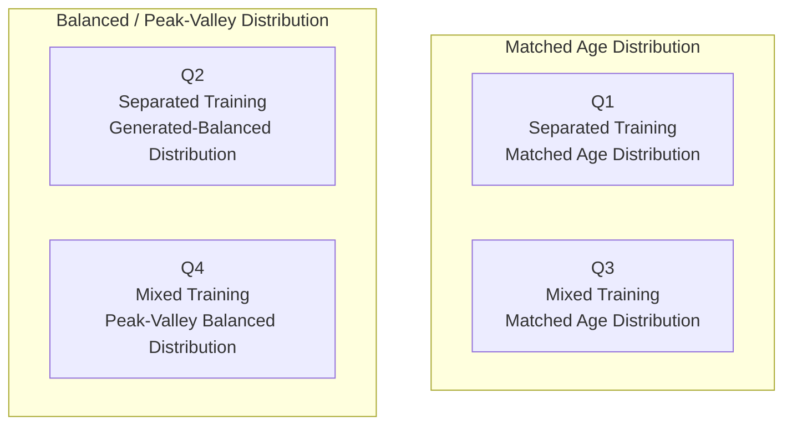

# SFCN 四象限 real/generated 年龄段分类实验

这个目录用于训练 `PyTorch` 版 `SFCN` 年龄段分类模型，比较真实 MRI 与 generated MRI 在不同训练和 augmentation 策略下的表现。

当前目标是四象限实验：

- Q1: `Separated Training + Matched Age Distribution`
- Q2: `Separated Training + Generated-Balanced Distribution`
- Q3: `Mixed Training + Matched Age Distribution`
- Q4: `Mixed Training + Peak-Valley Balanced Distribution`



详细设计见：

- `PRD_four_quadrant_real_generated_augmentation.md`
- `data.md`

旧的 `real-gen / gen-real` 结果已归档到：

```text
outputs/q1_separated_matched/
```

## 配置

统一配置文件：

```text
config.yaml
```

当前默认训练参数：

- `batch_size = 8`
- `learning_rate = 1e-4`
- `patience = 5`
- `max_epochs = 1000`
- `weight_decay = 1e-4`
- `log_interval = 100`
- `device = cuda`
- `seed = 42`

DataLoader worker 规则：

- macOS / Darwin: `num_workers = 0`
- Linux: `num_workers = max(1, cpu_count // 4)`

这样做是为了避免 Apple Silicon / MPS 上 `nibabel + PyTorch DataLoader 多进程` 卡死。
在 macOS 脚本中还会默认限制 `OMP_NUM_THREADS`、`MKL_NUM_THREADS` 和 `VECLIB_MAXIMUM_THREADS` 为 `4`，用于降低 HDD 读取 NIfTI 时的 CPU 线程抖动；Linux 不做这个线程限制。

设备默认配置为 `cuda`。如果 CUDA 不可用，训练代码会自动尝试使用 Apple Silicon 的 `mps`，再不可用时降级到 `cpu`。

## 防覆盖

训练、推理和画图默认不覆盖已有结果：

- `train.py` 发现 `checkpoints/best_model.pt` 已存在时会跳过训练。
- `infer.py` 发现 prediction CSV 已存在时会跳过推理。
- `evaluate_plot.py` 发现核心 figures 已存在时会跳过画图。

需要覆盖时显式加：

```bash
--force
```

## 状态扫描

查看四象限哪些步骤已经完成：

```bash
python3 main.py scan-status --only-missing
```

这个脚本只读文件系统，不训练、不推理、不画图。

## 生成数据来源

重建 Q1-Q4 的 manifest 数据来源：

```bash
python3 main.py build-manifests --quadrant all --force
```

这个命令只生成/覆盖 manifest，不训练模型。重建后，如果某个象限已经开始训练，旧 checkpoint 和 prediction 会与新 manifest 不一致；例如 Q2 已经按旧 generated 过大逻辑跑过时，需要重新训练和推理 Q2。

最终实验数为 6 个模型：Q1 两个、Q2 两个、Q3 一个 mixed、Q4 一个 mixed。Q3/Q4 的 train、val、test 总量与 separated 实验对齐，具体数量计算见 `data.md`。

## 画图规则

- Real 一律绿色。
- Generated 一律橙红色。
- MAE 用线表示。
- Count 用柱表示。
- 非混合实验中，训练域 count 柱为 `Train + Validation` 堆叠，测试域 count 为单段柱。
- 混合实验中，mixed train count 应显示为 `Real Train + Generated Train` 双色堆叠。
- 图例使用论文风格英文，并放在图外，避免遮挡。

## 运行脚本

最终保留 6 个 shell 入口：

- `scripts/run_q1.sh`: 运行 Q1 的两个模型
- `scripts/run_q2.sh`: 运行 Q2 的两个模型
- `scripts/run_q3.sh`: 运行 Q3 的一个 mixed 模型
- `scripts/run_q4.sh`: 运行 Q4 的一个 mixed 模型
- `scripts/run_plot.sh`: 统一画所有已完成实验的图
- `scripts/run_all.sh`: 顺序运行 Q1-Q4 和统一画图，主要用于 Linux 或复制命令

底层 Python 入口是通用的：

- `python3 main.py train --experiment <config-name>`
- `python3 main.py infer --experiment <config-name> --split <split-name>`
- `python3 main.py plot --experiment <config-name>`

`config.yaml` 决定每个 experiment 的数据路径、输出目录和 split。代码不为 Q1/Q2/Q3/Q4 分别写四套。

要求：

- 每个 Q 脚本可以中断恢复。
- 已完成的 manifest/checkpoint/prediction/figure 不重复生成。
- 除非显式 `--force`，不覆盖已有结果。

所有命令都假设当前目录已经是仓库根目录。

### 单独运行每个象限

```bash
./scripts/run_q1.sh
```

```bash
./scripts/run_q2.sh
```

```bash
./scripts/run_q3.sh
```

```bash
./scripts/run_q4.sh
```

### 只画图

```bash
./scripts/run_plot.sh
```

### 顺序运行全部

```bash
./scripts/run_all.sh
```

## 数据来源

Real MRI:

- 根目录：`/Volumes/LuZhang16T/IU_Datasets`
- 标签文件：`/Volumes/LuZhang16T/IU_Datasets/mapping_table.csv`

Generated MRI:

- 根目录：`/Volumes/LuZhang16T/generated_mri`

generated 文件名解析支持：

- `age1.00_sexM_s131.nii.gz`
- `0004_age0.00_sexF_s4.nii.gz`

generated 的 NIfTI header 不可信，训练和评估只按数组张量处理。
