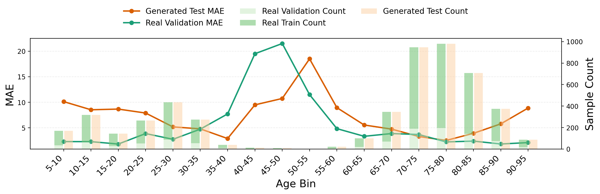
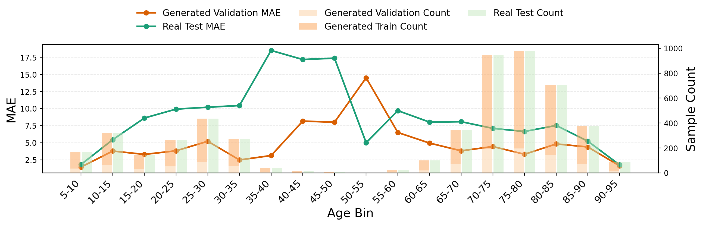
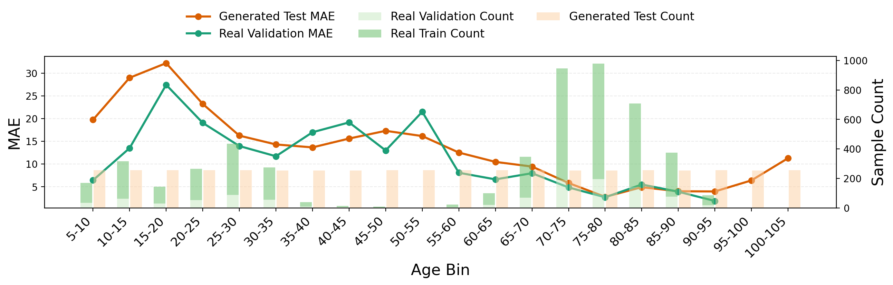
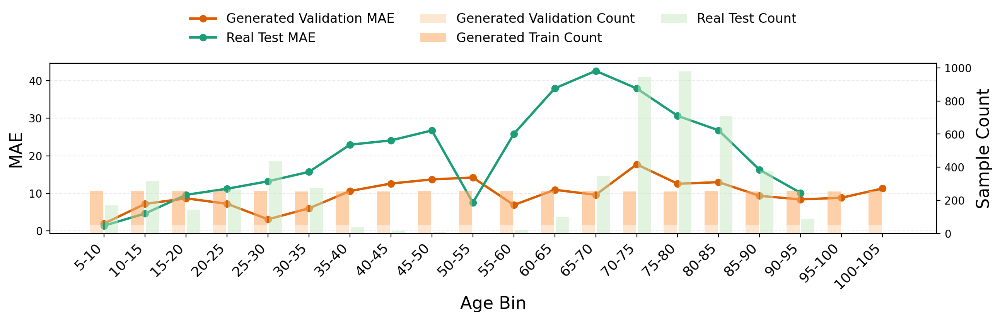
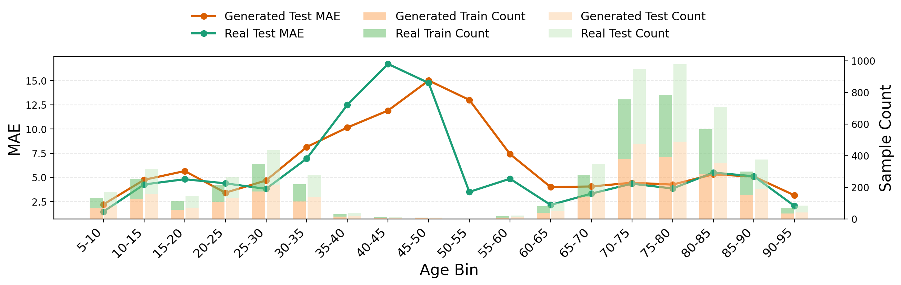
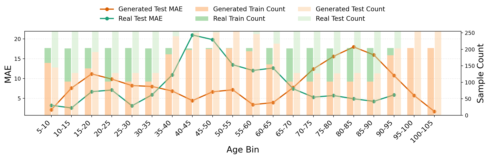

# SFCN Four-Quadrant Experiment Report

This file collects the SFCN four-quadrant experiment results. Some figures may be missing until training, inference, and plotting are complete; the final paths are kept here so the report becomes complete automatically after the workflow finishes.

## Quadrant Definitions

| Quadrant | Training Setup | Age Distribution Setup | Purpose |
| --- | --- | --- | --- |
| Q1 | Separated training | Matched real/generated age distribution | Controlled setting where real and generated samples have matched age/sex distributions. |
| Q2 | Separated training | Generated-balanced distribution | Tests cross-domain generalization when generated data is balanced across age bins. |
| Q3 | Mixed training | Matched real/generated age distribution | Ideal augmentation setting with matched real/generated distributions before mixed training. |
| Q4 | Mixed training | Peak-valley balanced distribution | Production-like augmentation setting: downsample real-data peaks and fill real-data valleys with generated samples. |

## Legend Rules

- Real data is always green.
- Generated data is always orange-red.
- Lines show MAE.
- Bars show sample counts.
- In separated-training experiments, training-domain bars stack `Train + Validation`.
- In mixed-training experiments, training bars stack `Real Train + Generated Train`.

## Q1: Separated Training + Matched Age Distribution

### 1. Q1 Real Training, Generated Testing



Male figure: `outputs/q1_separated_matched/real-gen/figures/male_age_bin_mae.png`

Female figure: `outputs/q1_separated_matched/real-gen/figures/female_age_bin_mae.png`

### 2. Q1 Generated Training, Real Testing



Male figure: `outputs/q1_separated_matched/gen-real/figures/male_age_bin_mae.png`

Female figure: `outputs/q1_separated_matched/gen-real/figures/female_age_bin_mae.png`

## Q2: Separated Training + Generated-Balanced Age Distribution

### 3. Q2 Real Training, Generated-Balanced Testing



Male figure: `outputs/q2_separated_gen_balanced/real-gen/figures/male_age_bin_mae.png`

Female figure: `outputs/q2_separated_gen_balanced/real-gen/figures/female_age_bin_mae.png`

### 4. Q2 Generated-Balanced Training, Real Testing



Male figure: `outputs/q2_separated_gen_balanced/gen-real/figures/male_age_bin_mae.png`

Female figure: `outputs/q2_separated_gen_balanced/gen-real/figures/female_age_bin_mae.png`

## Q3: Mixed Training + Matched Age Distribution

### 5. Q3 Mixed Matched



Male figure: `outputs/q3_mixed_matched/mixed/figures/male_age_bin_mae.png`

Female figure: `outputs/q3_mixed_matched/mixed/figures/female_age_bin_mae.png`

## Q4: Mixed Training + Peak-Valley Balanced Distribution

### 6. Q4 Mixed Peak-Valley Balanced



Male figure: `outputs/q4_mixed_peak_valley/mixed/figures/male_age_bin_mae.png`

Female figure: `outputs/q4_mixed_peak_valley/mixed/figures/female_age_bin_mae.png`

## Status Check

```bash
python3 main.py scan-status --only-missing
```
